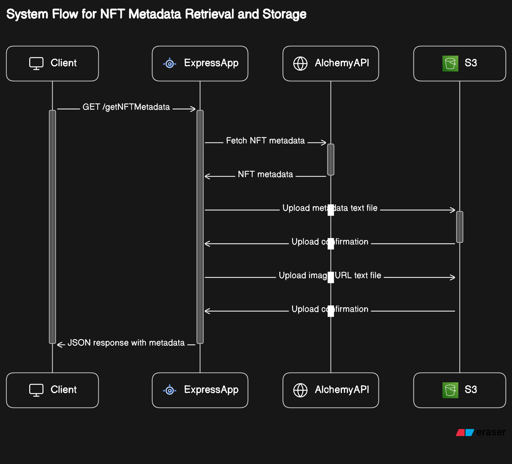

# NFT Microservice Architecture

## Objective

The objective of this project is to design a microservice architecture for handling NFTs across multiple blockchain networks (Ethereum, Polygon, Zora, and Optimism) using the Alchemy API. The microservice will also be capable of updating NFT data and images in an S3 bucket.

## Architecture

The microservice architecture will be designed using Node.js and Express.js for the backend, and AWS S3 for image storage. The architecture will be containerized using Docker and orchestrated using Kubernetes for scalability and efficiency.

## Functionality

The NFT and Image microservices will implement functionality to update NFT information based on a provided address. They will utilize the Alchemy API to fetch NFT data for the given address and update the NFT metadata in the S3.

## Supported Blockchains

The microservice will support updating NFTs across Ethereum, Polygon, Zora, and Optimism networks.

## Scalability and Efficiency

The microservice will be designed with scalability and efficiency in mind. It will be containerized using Docker and orchestrated using Kubernetes to handle varying loads and optimize resource usage. Potential bottlenecks such as network I/O will be mitigated using techniques like caching and load balancing.

## Deployment technique

### Prerequisites

1.  Docker installed on our local machine.
2.  Kubernetes cluster configured. You can use a managed Kubernetes service like Google Kubernetes Engine (GKE), Amazon Elastic Kubernetes Service (EKS), or set up a local cluster using Minikube.
3.  Docker Hub account for storing our Docker images.

### Steps to Deploy

1.  **Containerize our Application with Docker**:

    - Create a Dockerfile in the root directory of our project.
    - Configure the Dockerfile to build our Express microservice into a Docker image.
    - Build the Docker image locally using `docker build -t my-express-app .`. (considering you are building microservice using node)
    - Tag the Docker image with our Docker Hub username and repository name using `docker tag my-express-app myusername/myrepository`.
    - Push the Docker image to Docker Hub using `docker push myusername/myrepository`.

2.  **Deploy to Kubernetes**:

    - Ensure our Kubernetes cluster is up and running.
    - Create Kubernetes deployment YAML file (`deployment.yaml`) in our project directory.
    - Configure the deployment YAML file to specify the Docker image, ports, replicas, and any other required configurations.
    - Apply the deployment to our Kubernetes cluster using `kubectl apply -f deployment.yaml`.
    - Optionally, create a Kubernetes service YAML file (`service.yaml`) to expose our microservice to external traffic.
    - Apply the service YAML file using `kubectl apply -f service.yaml`.

3.  **Scaling**:

    - Scale our deployment horizontally by increasing the number of replicas in our deployment YAML file or using `kubectl scale` command.
    - Kubernetes will automatically handle load balancing across multiple replicas.

4.  **Monitoring and Logging**:

    - Implement monitoring and logging solutions such as Prometheus and Grafana for monitoring Kubernetes clusters and applications.
    - Configure our microservice to output logs to stdout/stderr, which can be collected by Kubernetes logging solutions like Fluentd or Loki.

5.  **CI/CD Pipeline**:

    - Implement a CI/CD pipeline to automate the build, test, and deployment process of our microservice using tools like GitHub Actions which works great.
    - Integrate the pipeline with our version control system to trigger automatic deployments on code changes.

6.  **Security**:

    - Implement role-based access control (RBAC), network policies, and container security best practices to protect our applications and data.

# Security Measures Against DDoS Attacks for API and S3

In addition to deployment security, it's crucial to protect our API and S3 storage from Distributed Denial of Service (DDoS) attacks, which can overwhelm our services and disrupt their availability. Here's how you can enhance security against DDoS attacks:

### 1. Implement DDoS Protection Services:

- **Use DDoS Protection Services**: Consider using DDoS protection services provided by cloud service providers like AWS Shield, Cloudflare, or Akamai. These services can detect and mitigate DDoS attacks, helping to maintain service availability.

### 2. API Security Measures:

- **Rate Limiting**: Implement rate limiting on our API endpoints to restrict the number of requests from a single client within a specified time frame. This prevents an attacker from flooding our API with excessive requests.
- **API Gateway**: Utilize API gateways provided by cloud providers to manage and secure incoming API traffic. API gateways offer features such as authentication, authorization, and request throttling to protect against DDoS attacks.

### 3. S3 Security Measures:

- **Access Control Policies**: Apply appropriate access control policies to our S3 buckets using AWS IAM (Identity and Access Management). Limit access to only trusted entities and enforce the principle of least privilege.
- **Enable Encryption**: Enable server-side encryption for our S3 buckets to protect data at rest. Use AWS Key Management Service (KMS) for managing encryption keys securely.

### Error Handling:

1.  **Input Validation**: Implement robust input validation mechanisms to ensure that the incoming requests contain the required parameters and are properly formatted. This helps prevent malformed requests from causing errors in the microservice.
2.  **Custom Error Responses**: Provide descriptive error messages and appropriate HTTP status codes in the responses to help clients identify the nature of errors. This includes handling cases such as invalid network specified or internal server errors gracefully.
3.  **Logging**: Enhance error handling with comprehensive logging mechanisms to record details of errors. Logging helps in troubleshooting issues and monitoring the performance of the microservice over time.

### Testing Strategy:

1.  **Unit Testing**: Develop unit tests to verify the functionality of individual components and functions within the microservice. Unit tests should cover edge cases, boundary conditions, and error scenarios to ensure robustness.
2.  **Integration Testing**: Conduct integration tests to validate the interactions between different modules of the microservice, including external dependencies such as the Alchemy API and AWS S3. Integration tests help in identifying any issues with the integration points.

### Performance Optimization:

1.  **Caching**: Implement caching mechanisms to store frequently accessed data, such as NFT metadata or image links, in memory or a distributed cache. Caching reduces the need to fetch data from external APIs repeatedly, improving response times and reducing latency.
2.  **Asynchronous Processing**: Utilize asynchronous processing techniques, such as asynchronous function calls or message queues, to handle tasks that can be executed independently of the main request-response cycle. Asynchronous processing improves concurrency and scalability by decoupling time-consuming operations from the request handling.
3.  **Optimized Resource Usage**: Monitor and optimize resource usage, including CPU, memory, and network bandwidth, to ensure efficient utilization of resources. This involves profiling the microservice to identify performance bottlenecks and optimizing algorithms or configurations accordingly. Additionally, consider containerization and orchestration strategies to dynamically scale resources based on demand.

## My code System Flow

## Working of my code

- It imports necessary modules like express, AWS, dotenv, and Alchemy.

- It configures the environment using dotenv to load environment variables from a .env file.

- It creates an Express application and sets the port to either the one specified in the environment variables or defaulting to 3000.

- It initializes an AWS S3 instance using credentials from environment variables.

- It defines an interface Setting and an array settings containing API keys for different blockchain networks (Ethereum Mainnet, Optimism, and Polygon).

- Middleware is set up to parse JSON requests.

- It defines a route "/getNFTMetadata" for handling GET requests to fetch metadata of an NFT.

- Within the route handler, it retrieves contract address, token ID, and network from the request body, finds the corresponding setting based on the network, initializes an Alchemy instance with the selected setting, and fetches NFT metadata using Alchemy SDK.

- The fetched metadata is then structured into a response object, uploaded to AWS S3 as a text file, and sent as a JSON response to the client.

- It defines a default route handler for the root path "/", responding with "Assignment part 1".

- There's an asynchronous function uploadMetadataToS3 which takes metadata as input, converts it to a JSON string, and uploads it to S3 as a text file. It also extracts the image URL from the metadata, uploads it to S3 as another text file.

- Finally, the server starts listening on the specified port, and a message is logged to indicate that the server is running.

## Deployed Link

- <a href="https://assignment1-we2b.onrender.com">🌐 Deployed service link</a>
